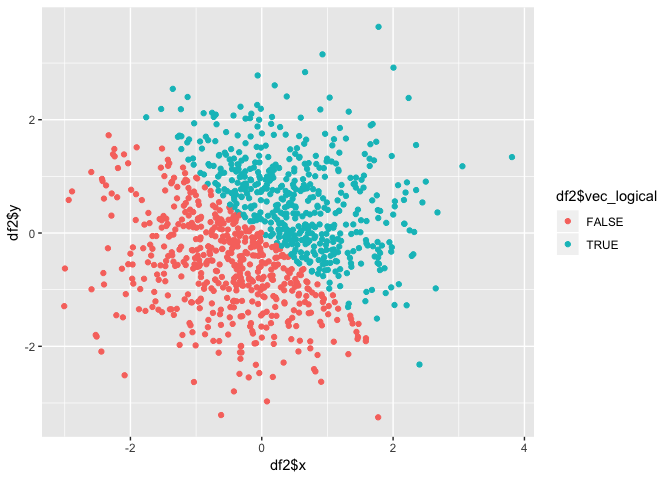
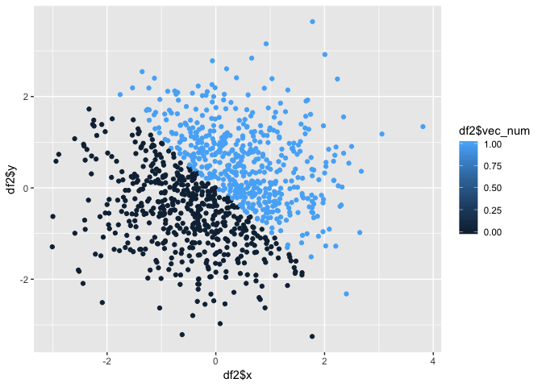
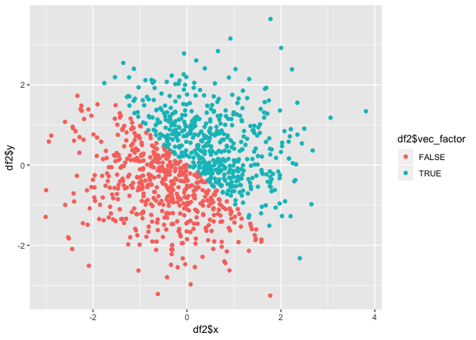

p8015\_hw1\_tl2882
================
Tian Li
2018-09-14

Problem 1
=========

Create a data frame
-------------------

``` r
set.seed(1)

df = tibble(
  random_sample = runif(10, min = 0, max = 5),
  vec_logical = (random_sample > 2),
  vec_char = c("A", "B", "C", "D", "E", "a", "b", "c", "d", "e"),
  vec_factor = factor(c("A", "B", "C", "D", "E", "a", "b", "c", "d", "e"))
)
```

Try to take the mean
--------------------

``` r
mean(df$random_sample)
```

    ## [1] 2.757569

``` r
mean(df$vec_logical)
```

    ## [1] 0.6

``` r
mean(df$vec_char)
```

    ## Warning in mean.default(df$vec_char): argument is not numeric or logical:
    ## returning NA

    ## [1] NA

``` r
mean(df$vec_factor)
```

    ## Warning in mean.default(df$vec_factor): argument is not numeric or logical:
    ## returning NA

    ## [1] NA

1.Succeed: normal arithmetical mean

2.Succeed: "ture" means "1", and "false" means "0"

3.Fail: only numeric or logical vector can calculate the mean

4.Fail: only numeric or logical vector can calculate the mean

Convert variables
-----------------

### Applies the as.numeric function

``` r
as.numeric(df$vec_logical)
as.numeric(df$vec_char)
```

    ## Warning: NAs introduced by coercion

``` r
as.numeric(df$vec_factor)
```

What happens? Two success, one warning.

1.  Succeed ("ture" is converted to "1", and "false" is converted to "0")
2.  Fail: can't be converted to numeric
3.  Succeed : can be converted to numbers which represent their alphabetical order

### Convert character variable from character to factor to numeric

``` r
as.factor(df$vec_char)
```

    ##  [1] A B C D E a b c d e
    ## Levels: a A b B c C d D e E

``` r
as.numeric(as.factor(df$vec_char))
```

    ##  [1]  2  4  6  8 10  1  3  5  7  9

First, ten individual characters are converted to ten factors.
(As shown in the result, these factors can be sorted acorrding alphabetical order.)

Then, these factors are converted to ten numbers which represent their alphabetical order.

### Convert factor variable from factor to character to numeric

``` r
as.character(df$vec_factor)
```

    ##  [1] "A" "B" "C" "D" "E" "a" "b" "c" "d" "e"

``` r
as.numeric(as.character(df$vec_factor))
```

    ## Warning: NAs introduced by coercion

    ##  [1] NA NA NA NA NA NA NA NA NA NA

First, ten factors are converted to ten individual characters literally.

Then, it shows that the letters in "characater" type can't be converted to numerics.

Problem 2
=========

Create a data frame
-------------------

``` r
set.seed(1)

df2 = tibble(
  x = rnorm(1000),
  y = rnorm(1000),
  vec_logical = (x + y) > 0,
  vec_num = as.numeric(vec_logical),
  vec_factor = as.factor(vec_logical)
)
```

\*The size of the dataset is (1000, 5)

\*The mean of x is -0.0116481, the median of x is -0.0353242

\*The proportion of cases for which the logical vector is TURE is 0.49

Make three scatterplots
-----------------------

``` r
scatter_plot1 = ggplot(df2, aes(x = df2$x, y = df2$y, color = df2$vec_logical)) + geom_point() 
scatter_plot1
```



``` r
scatter_plot2 = ggplot(df2, aes(x = df2$x, y = df2$y, color = df2$vec_num)) + geom_point()
scatter_plot2
```



``` r
scatter_plot3 = ggplot(df2, aes(x = df2$x, y = df2$y, color = df2$vec_factor)) + geom_point()
scatter_plot3
```



comment on the color scales:
all the boundaries between two colors in three plots are the line: y = -x

Save first scatterplot
----------------------

``` r
ggsave("first_scatterplot.pdf", plot = scatter_plot1)
```

    ## Saving 7 x 5 in image
